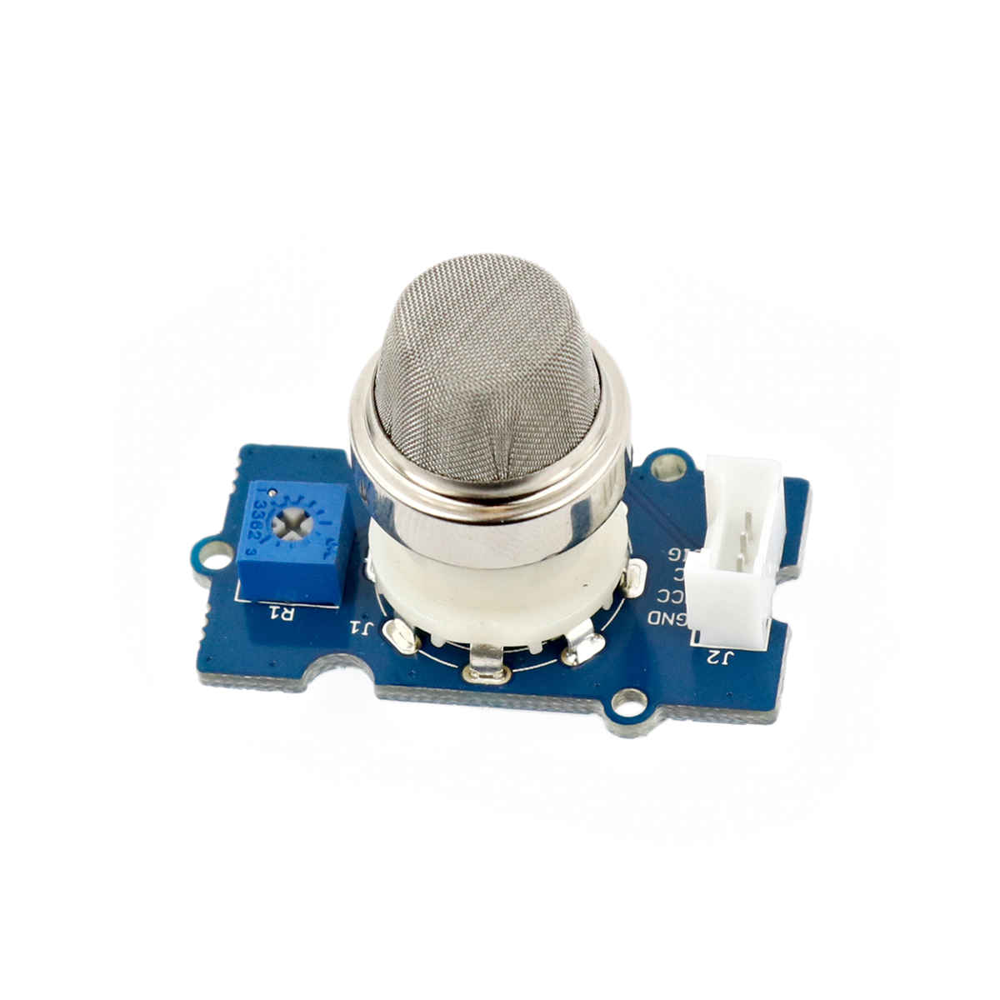

---
title: "Gassensor"
date: "2018-10-01T13:25:00.000Z"
tags: 
  - "sensor"
coverImage: "11_gassensor.jpg"
material_number: "11"
material_type: "sensor"
material_short_descr: "Seeed Studio Grove – Gas Sensor (MQ2)"
manufacture: "Seeed Studio"
manufacture_url: "https://www.seeedstudio.com/"
repo_name: "mks-SeeedStudio-Grove_Gas_Sensor-MQ2"
repo_prefix: "mks"
repo_manufacture: "SeeedStudio"
repo_part: "Grove_Gas_Sensor-MQ2"
product_url: "https://wiki.seeedstudio.com/Grove-Gas_Sensor-MQ2/"
clone_url: "https://github.com/Make-Your-School/mks-SeeedStudio-Grove_Gas_Sensor-MQ2.git"
embedded_example_file: "examples/Grove_Gas_Sensor-MQ2_minimal/Grove_Gas_Sensor-MQ2_minimal.ino"
---

# Gassensor

## Beschreibung
Der Grove Gas Sensor MQ2 erfasst Leckströme von Verbrennungsgasen (beispielsweise Rauch). Er besitzt eine hohe Sensitivität und eine schnelle Reaktionszeit. Er benötigt allerdings in vielen Fällen eine längere Kalibrierungsphase vor der ersten Benutzung. Die Sensitivität kann direkt auf dem Sensor mithilfe des Potentiometers eingestellt werden.

Der Sensor kann direkt oder mithilfe des Grove Shields an einen Arduino angeschlossen werden. Er gibt dabei die Konzentration über den analogen Pin aus.

Alle weiteren Hintergrundinformationen sowie ein Beispielaufbau und alle notwendigen Programmbibliotheken sind auf dem offiziellen Wiki (bisher nur in englischer Sprache) von Seeed Studio zusammengefasst. Hier wird man ebenfalls Schritt für Schritt durch die Kalibrierung geführt. Zusätzlich findet man über alle gängigen Suchmaschinen durch die Eingabe der genauen Komponentenbezeichnung entsprechende Projektbeispiele und Tutorials.

<!-- infolist -->

<!-- infolists -->
## Wichtige Links für die ersten Schritte:

- [Seeed Studio Wiki](http://wiki.seeedstudio.com/Grove-Gas_Sensor-MQ2/) [- Gas Sensor](http://wiki.seeedstudio.com/Grove-Gas_Sensor-MQ2/)

## Weiterführende Hintergrundinformationen:

- [GPIO - Wikipedia Artikel](https://de.wikipedia.org/wiki/Allzweckeingabe/-ausgabe)
- [GitHub-Repository: Gassensor](https://github.com/MakeYourSchool/11-Gas-Sensor)

